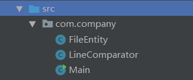
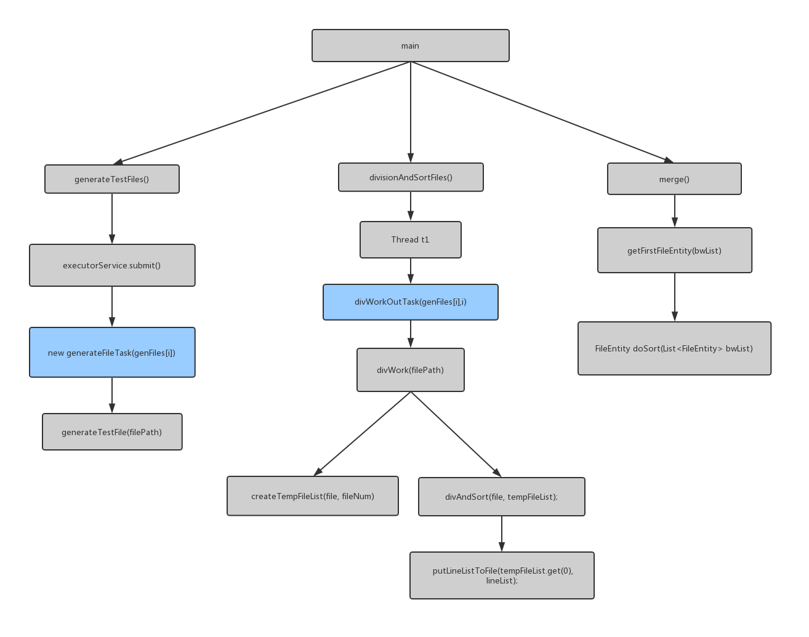
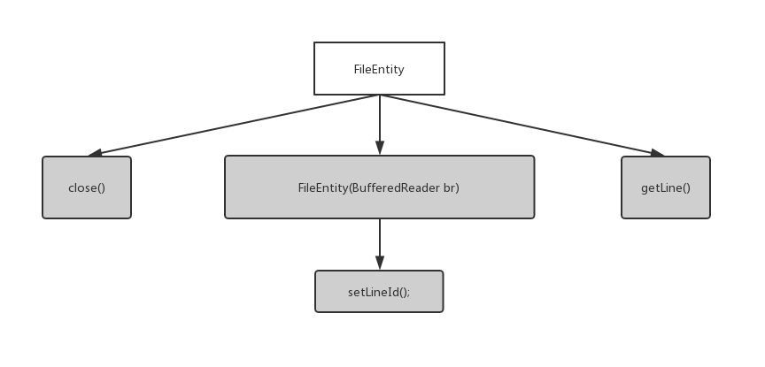
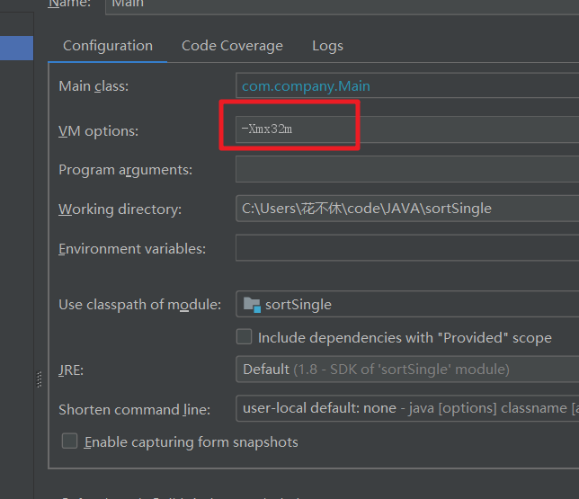
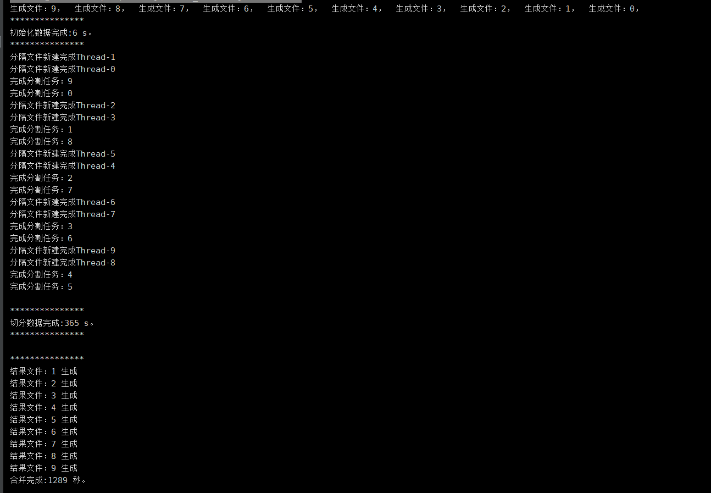
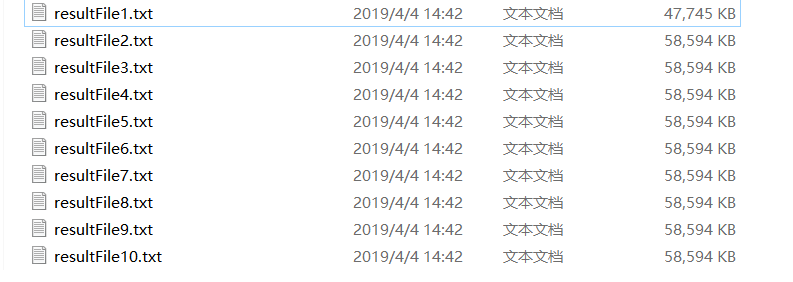
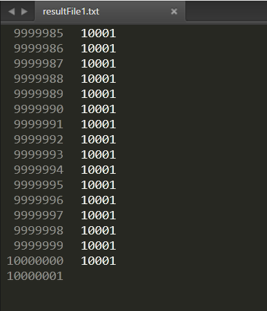

#  1亿数据Sort 文档

## 题目

有10个文件，每个文件有1000万行，文件内容的每一行为一个正整形数字。需要写一个程序，将所有数字排序，分为10个文件输出，如0号文件包含前1000万个数字，1号文件文件包含1千万-2千万之间的数字，依次类推。

### 限制：

如果使用Java，-Xmx参数需要设置为32MB。其它语言也需限制内存为32MB。

### 要求

1. 正确输出结果

2. 使用多线程将会加分

3. 编写时长24小时

4. 提供可运行的程序，以及实现说明

## 解决方案

1. 每个数据文件都超出内存空间，所以不能直接读入，使用分治的思想，首先做拆分，把大文件都拆分成1mb大小的块

2. 把拆分好的小文件都排好序，在写回文件中

3. 合并文件，使用归并排序算法，把所有的小文件归并成结果集文件

## 程序描述 

### 文件结构

* FileEntity : File包装类，用于按行读取

* LineComparator :  排序比较接口，第一次拆分小文件排序用

* Main : 排序类和程序执行入口类

### 函数调用图

#### 1. Main

#### 2. FileEntity

### 执行流程

1. main 函数首先调用generateTest 生成测试数据，generateTest启动10个线程，设置数据文件名genFiles数组，并获取到要生成的数据名，每个线程生成一千万个正整形数字，通过ByteBuffer 设置缓冲区，然后分批次写入数据
2. main 函数调用 divisionAndSortFiles 去进行分治，分批次调用两个线程去拆分大文件和排序小文件。首先divWork计算小文件个数和生成小文件名，调用createTempFileList创建需要拆分的小文件，返回小文件列表，然后调用divAndSort去进行去读大文件，并对读取出一个小文件的大小部分，调用putLineListToFile进行排序和写入，调用Collection.sort进行内部排序。

3. main函数对调用merge进行归并，通过小文件列表创建小文件读取FileEntity 列表，调用getFirstFileEntity遍历文件读取列表，调用doSort选取最小值并返回，merge 然后对读取的结果进行统计，一千万条数据创建一个新文件，并不断写入数据。

### 使用方法

1. 设置Main 类中的 静态常量ROOT_FILE_PATH，设置文件读取目录
2. 然后根据内存大小调整小文件切分的大小，即调整 SIZE常量的大小
3. 即可正常运行。

## 效果

* 虚拟机内存设置大小32mb

* 运行时间
  * 生成数据 9s
  * 分隔任务 365s
  * 归并排序 1289s

* 结果集
  * 

* 每个文件从1到一千万，升序排列	

